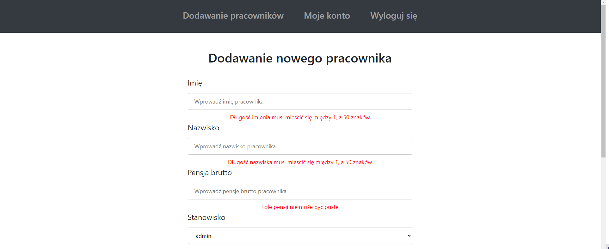
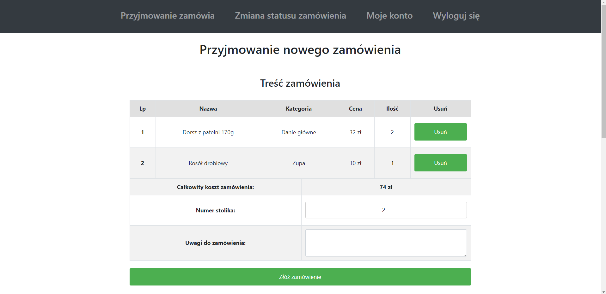

# Aplikacja webowa do zarządzania przyjmowaniem oraz wydawaniem zamówień w restauracji
Aplikacja posiada trzy typy kont:
* administrator
* kelner
* kucharz

Aby uzyskać dostęp do aplikacji należy najpierw się zalogować.

Administrator dodaje nowych pracowników do bazy danych.

Kelner przyjmuje zamówienia od klientów oraz zmienia status zamówienia po jego dostarczeniu oraz przyjęciu zapłaty.

Dodawanie nowego zamówienia

Zmiana statusu zamówienia:

Kucharz zmienia status zamówienia na gotowy do dostarczenia przez kelnera do klienta.

Dodatkowo każdy użytkownik może zmienić hasło dostepu do swojego konta oraz się wylogować.

